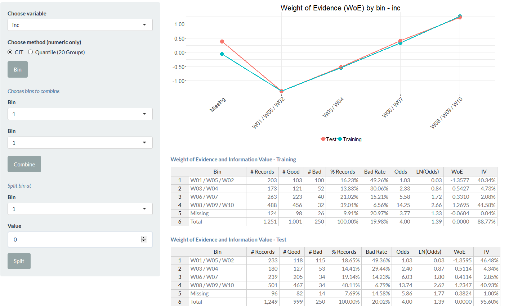

### Binning

The general objective of binning is to obtain a strong separation of the weight of evidence (WoE) between bins and a high information value (IV) for the characteristic.
C1 

This is generally done by constructing an initial set of bins, and then splitting and combining bins to arrive at a desired pattern. For each bin j, the WoE for that bin is defined by the following formula (where N is the total number of bins).


```
## Error in knitr::include_graphics("www/binning-woe.png"): Cannot find the file(s): "www/binning-woe.png"
```

The IV is calculated at the characteristic level. Higher the IV, the more the predictive power of this characteristic in separating goods from bads. A general rule of thumb is that to be considered in the model the IV must be at least 3%.


```
## Error in : Cannot find the file(s): "www/binning-iv.png"
```

The following diagrams show a numeric and a character variable, after they have been binned to obtain a monotonic WoE pattern.


```
## Error in knitr::include_graphics("www/binning-numeric.png"): Cannot find the file(s): "www/binning-numeric.png"
```


```
## Error in : Cannot find the file(s): "www/binning-character.png"
```
