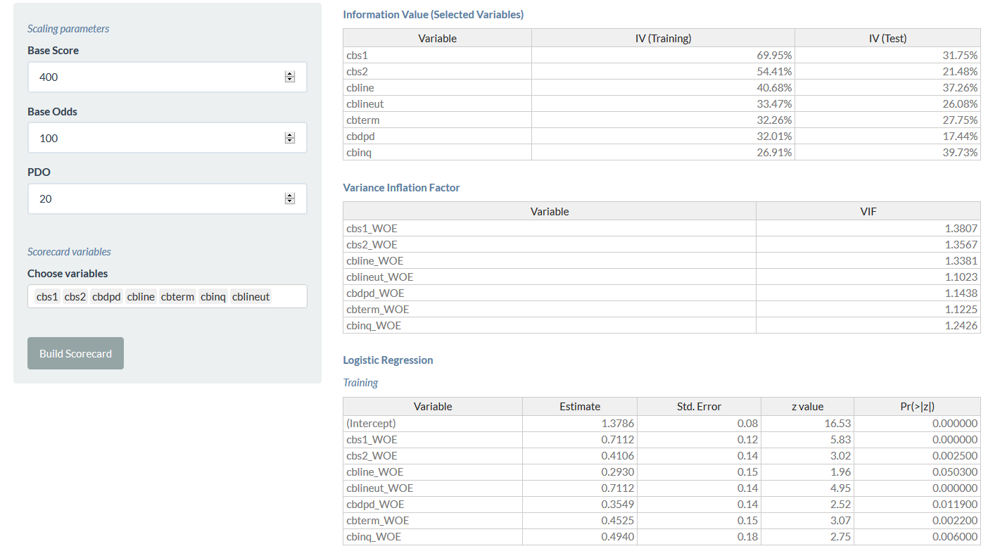
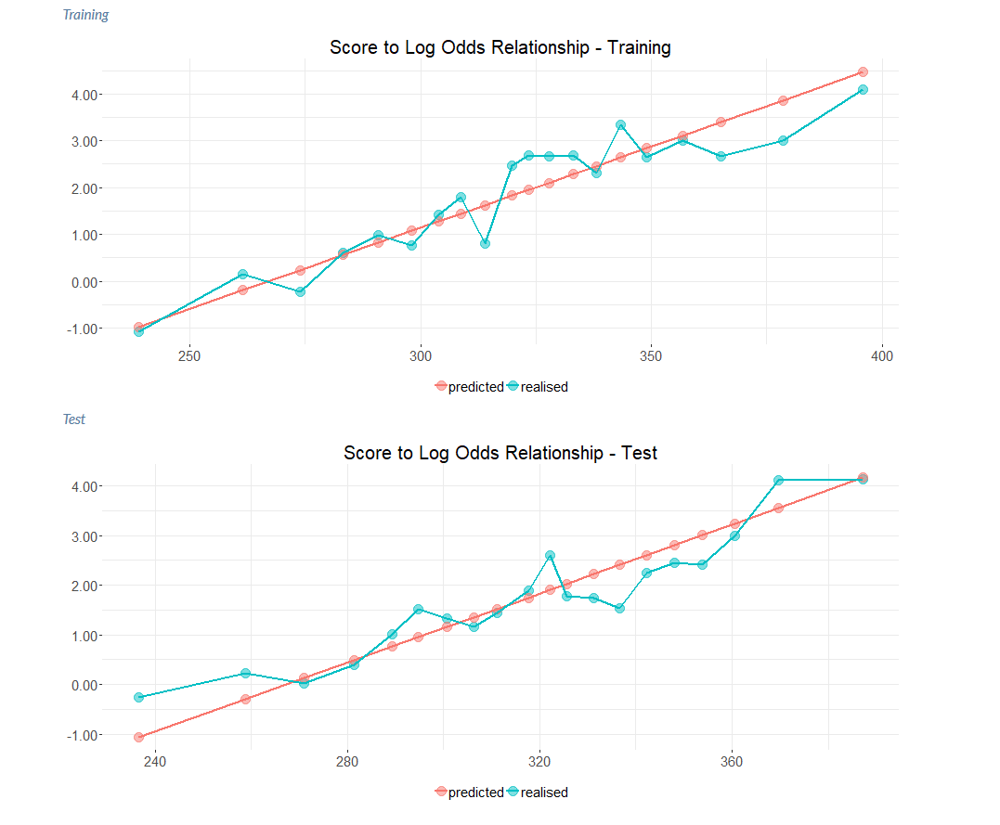
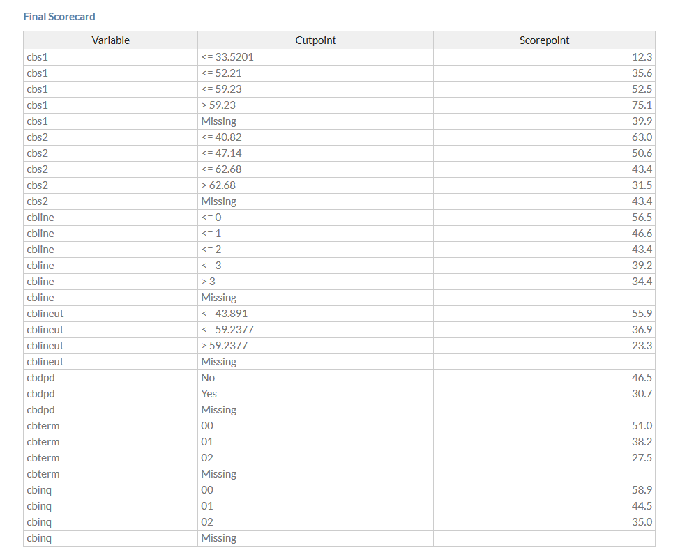

### Model

The modelling process comprises three main stages

* Choosing the list of variables in the scorecard

* Running a logistic regression to determine which variables are significant and testing for multicollinearity

* Scaling the scores to obtain a specific log good-bad odds at a base score and and the points required to double the odds (PDO)

Use the 'Scorecard variables' interface to determine which variables should be considered in the scorecard. The scaling parameters can also be entered in the interface.

The following should be checked before finalising the scorecard

* Variance Inflation Factor (VIF) - a VIF of more than 2 indicates that more than 50% of a variation in that variable is explained by the other variables; it is advised that all variables have a VIF less than 2

* The sign of the Estimate in the logistic regression output should be intuitive and the p-value significant (value should be close to 0)

* The score to log-odds relationships are approximately linear


```
## Error in : Cannot find the file(s): "www/model-logistic.png"
```


```
## Error in : Cannot find the file(s): "www/model-stoln.png"
```


```
## Error in : Cannot find the file(s): "www/model-scorecard.png"
```
