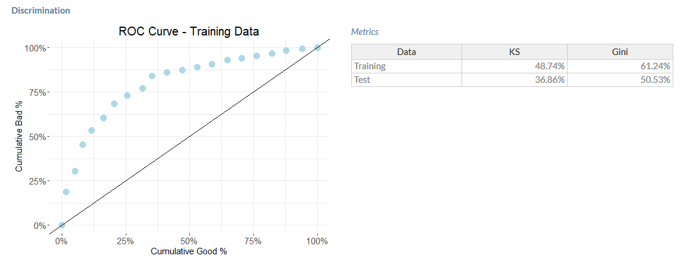
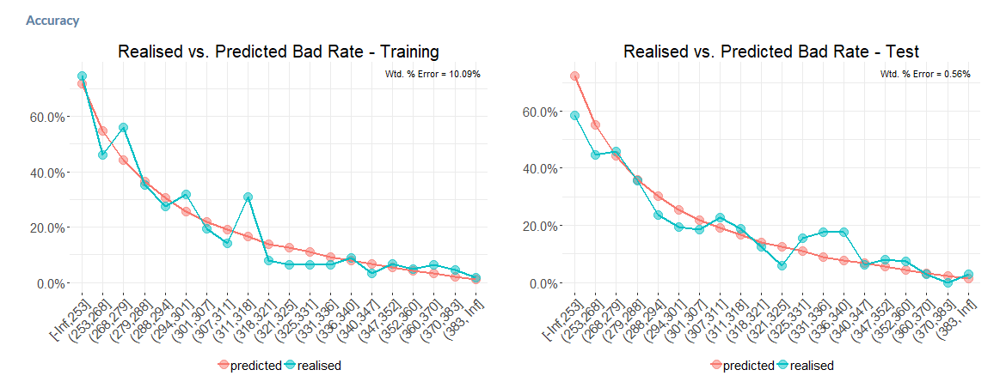
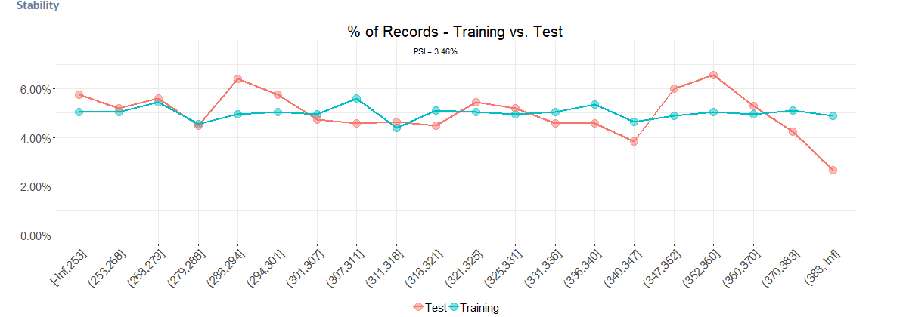

### Validation

The scorecard is validated based on three key parameters

* Discrimination measures the ability of the score to separate between goods and bads and is typically measured using the KS and Gini coefficient

* Accuracy measures the percentage error (PE) between the predicted and realised bad rates at all levels of the score

* Stability measures the difference in score distribution between the training and test samples and is measured by the Population Stability Index (PSI)

Rules of thumb

* A Gini of 50% or higher provides strong discrimination

* Weighted average PE should be less than 10%

* PSI should be less than 10% (PSI uses the same formula as IV except that the distribution of records are used rather than the percentage of good and bad records)


```
## Error in : Cannot find the file(s): "www/validation-discrimination.png"
```


```
## Error in : Cannot find the file(s): "www/validation-accuracy.png"
```


```
## Error in : Cannot find the file(s): "www/validation-stability.png"
```
